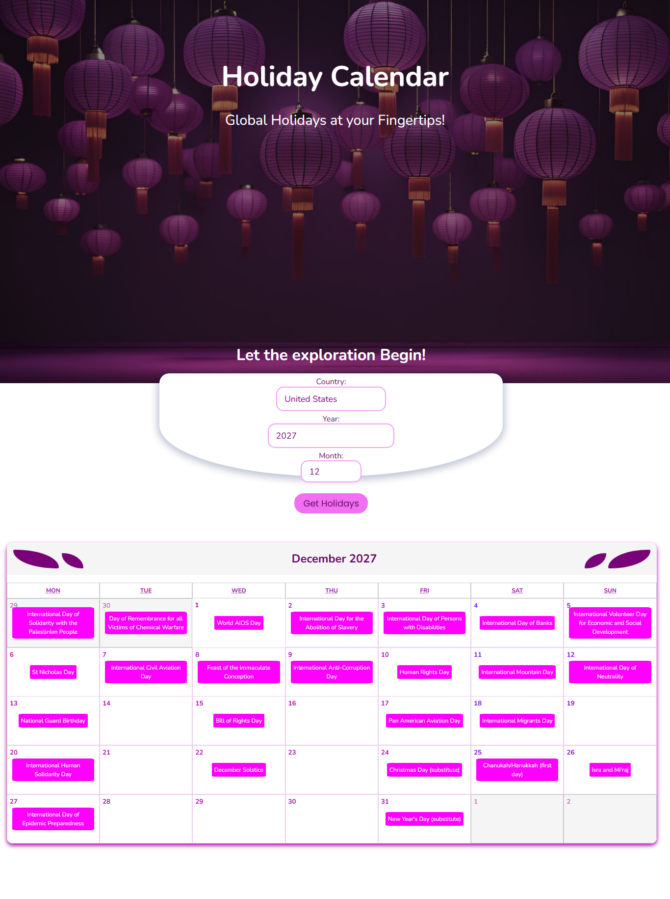

# Holiday Calendar

<strong><em> Global Holidays at your Fingertips! </strong></em>

## Description

This is a web app that displays the holidays of the selected country in a web-based monthly calendar.

It enables you discover and familiarise yourself with past, present and future holidays and events of <strong> OVER 200 COUNTRIES </strong> around the world!

## Design

## How to Use

1. Enter the country name or select desired country from drop down list in the <strong> Country </strong> input field
2. Enter the desired year and month of whose holiday you want to view, or click upper/lower buttons to edit displayed numbers in the year & month input fields
3. Click <strong> Get Holidays </strong> button
4. Scroll down to calendar to view the requested holidays in the monthly calendar.

## Features

- My design!!!
- Requesting data fetched from the API and sending in to the Frontend using Axios.
- Single Page Application

## Tech Stack
- HTML
- CSS
- React
- JS/ES6+
- Axios
- REST

## Tech Stack +
- Create react-app
- Fetching and sending data to the frontend
- Hooks (useState, useEffect, useRef)
- Customized react-calendar

## Running the App (frontend demo)
- Download the project into your computer and open it in a development tool (e.g. VS Code)
- In the terminal, load "npm install"
- Load "npm staet" to run the App

## Author
Abdulbasit - Software Engineer (Frontend)

abdulbasit.oa7@gmail.com